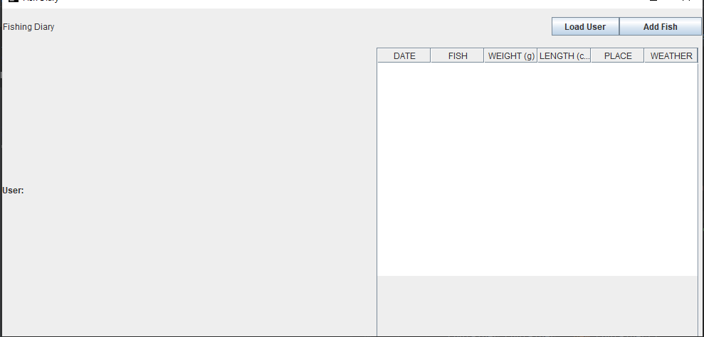
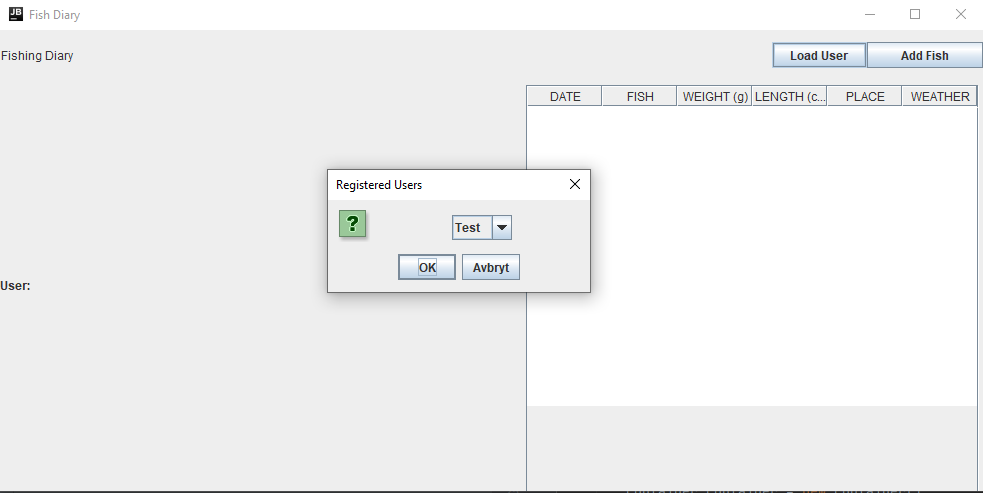
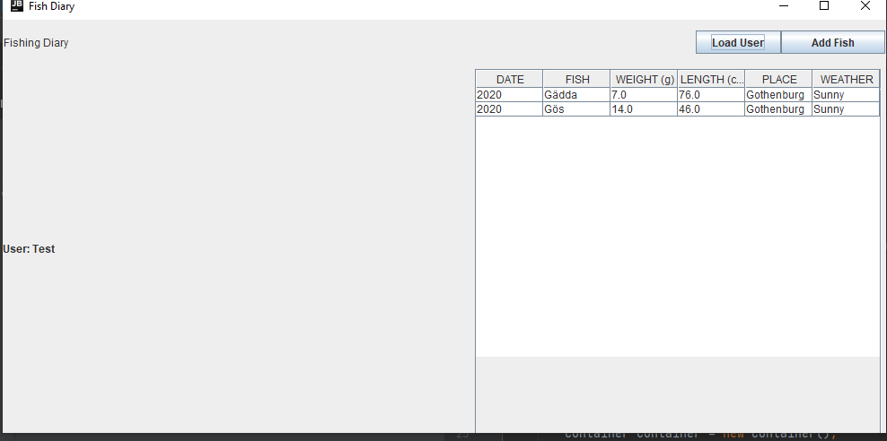

# Simple GUI for FishDiary

This GUI is built with Java Swing

It requires [Fishingdiary](https://github.com/BKristenssonAlfsson/fishingdiary) to be downloaded and installed before trying to fetch data.
Follow the steps in that Repos README to have it running.

### Current state:

When starting the application you get this window loaded:

When loading a user:

Which will generate a table with all catches from the database:

When loading a new user, table will be emptied before adding in new rows